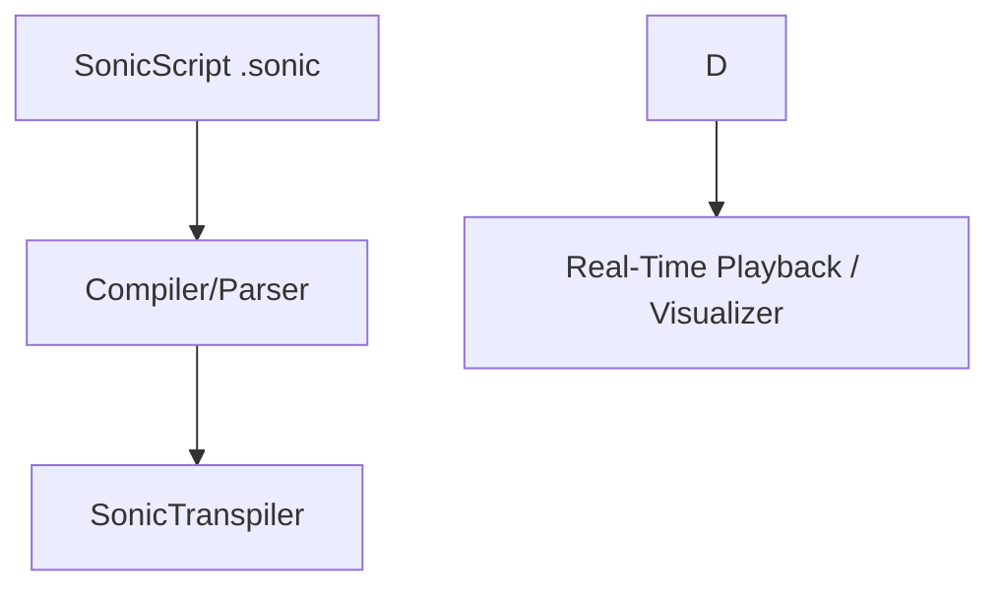

# 🎼 White-Box Composer
**The AI-Powered Generative Music Engine**

White-Box Composer is a professional-grade generative music engine designed for high-precision audio production. It treats music as a first-class citizen of the code world, allowing you to synthesize professional-quality audio in real-time.

---

## 🏛️ High-Level Architecture

The engine is built on two distinct, powerful layers:

- **PySynth (The Core)**: A pure-Python modular DSP library. It handles the raw mathematics of sound: oscillators, filters, 10ms-accuracy synthesis, and real-time effects chaining.
- **SonicScript (The Interface)**: A Domain-Specific Language (DSL) built on top of PySynth. It provides a human-readable, high-resolution 1/16th note sequencer, variable-based sound design, and master-bus processing.



---

## 🎼 SonicScript Syntax Reference

SonicScript is a declarative, Python-inspired DSL. Below is the high-level syntax for all core features:

### 1. Variables & Chaining
Define a sound graph once and reuse it across your tracks.
```sonic
# def [name] = [instrument] | [effect] [params]
def dark_bass = saw | lpf 120 | dist 0.8
```

### 2. Signal Processing (The Pipe `|`)
Audio flows from left to right. You can chain infinite effects.
```sonic
# Source -> Effect A -> Effect B
def pad = sine | reverb mix:0.6 | gain 0.5
```

### 3. Track Blocks (The Sequencer)
Tracks handle the arrangement. Each track is an independent synthesis thread.
```sonic
track [name]:
    bpm [number]       # Tempo (1-1000)
    swing [0.0-1.0]    # Rhythmic shuffle
    humanize [seconds] # Random micro-timing jitter
    play [sound]: [grid]
```

### 4. Sequencer Grid Notation
Each symbol represents a **1/16th note** (4 symbols = 1 beat).
- `C4`, `G#3`: Trigger specific notes.
- `X`: **Accent** (Velocity 1.2)
- `x`: **Normal** (Velocity 0.9)
- `.`: **Ghost Note** (Velocity 0.4)
- `-`: **Sustain** (Hold the previous note)
- `..`: **Silence** (Hard cutoff)
- `euclidean(hits, steps)`: Generative mathematical pattern.

### 5. Master Bus
The `master:` block is the final stage of the signal chain.
```sonic
master:
    # 'input' references the summed mix of all tracks
    input | hpf 30 | maximizer 0.95
```

---

## 🚀 Quick Start

### 1. Installation
Clone and install the package in developer mode:
```bash
git clone https://github.com/white-box/composer.git
cd white-box-composer/sonic_script
pip install -e .
```

### 2. Execution
```bash
# Play a production
sonic travis_vibe.sonic

# Run with Visual Mix Report
sonic travis_vibe.sonic -v
```

---

## 🎨 Professional Production Suite

White-Box Composer goes beyond standard MIDI sequencing by offering studio-grade features for "The New School" sound:

### 🥁 Advanced Rhythm Engine
*   **MPC-Style Swing**: Rhythmic humanization that delays 16th-note off-beats for that "Dilla" bounce.
*   **Micro-Timing Jitter**: `humanize 0.02` adds organic +/- 20ms timing shifts to mimic human performance.
*   **Dynamic Phrasing**: Support for **Accents** (`X`), **Normal** hits (`x`), and **Ghost Notes** (`.`) directly in the sequencer.
*   **Euclidean Generator**: `euclidean(hits, steps)` automatically creates complex mathematical grooves (Afrobeat, Jazz, Reggaeton).

### 🧊 Advanced Synthesis & Sampling
*   **Granular Glitch**: `granulate` audio into 40ms grains to create ethereal textures and cloud-like pads.
*   **Beat Slicing**: `sliceloop` uses transient energy detection to automatically chop drum loops into individual hits.
*   **Warp Drive**: Real-time half-speed and reverse effects using `timewarp`.
*   **FM Synthesis**: High-fidelity 2-operator frequency modulation for metallic leads and dark bells.

### 🖼️ Visual Intelligence
*   **Mix Report**: Running with `-v` generates a high-performance **Matplotlib Spectrum Analyzer**. Focus on your dynamic range and visualize overlapping frequencies between your 808 and Kick.

---

## 🛠️ Project Structure

```text
sonic_script/
├── compiler/           # The Engine's Brain (Lark Parser & Transpiler)
│   ├── grammar.lark    # Domain-specific syntax rules
│   ├── transpiler.py   # DSL-to-DSP Graph transformation
│   └── cli.py          # Command-line interface & Visualizer
├── pysynth/            # The DSP Foundation (Modular Synthesis)
│   ├── core.py         # AudioNode base architecture
│   ├── generators.py   # FM/Sine/Saw/Sampler implementations
│   ├── dsp.py          # Granular, Reverb, Delay, Sidechain
│   ├── slicing.py      # Transient Detection & Peak Analysis
│   └── instruments/    # Factory Category (Drums, Bass, Synths)
├── astroworld.sonic    # Feature Showcase: FM Bells, Euclidean Hats, Swing
└── travis_vibe.sonic   # Production Showcase: 808 Saturation, Master Glue
```

---

## 📜 License
MIT License. Created for the next generation of AI-driven audio production.
